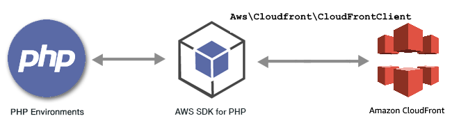

.. Copyright 2010-2019 Amazon.com, Inc. or its affiliates. All Rights Reserved.

   This work is licensed under a Creative Commons Attribution-NonCommercial-ShareAlike 4.0
   International License (the "License"). You may not use this file except in compliance with the
   License. A copy of the License is located at http://creativecommons.org/licenses/by-nc-sa/4.0/.

   This file is distributed on an "AS IS" BASIS, WITHOUT WARRANTIES OR CONDITIONS OF ANY KIND,
   either express or implied. See the License for the specific language governing permissions and
   limitations under the License.

################################################
|CFlong| Examples Using the |sdk-php| Version 3
################################################

.. meta::
   :description: Amazon CloudFront code examples for the AWS SDK for PHP version 3.
   :keywords: Amazon CloudFront code examples for PHP, Amazon CloudFront Data for PHP.

|CFlong| is an AWS service that manages the distribution of web content to edge locations. Store static files from |S3| in multiple origin servers,
or use |EC2| to deliver dynamically generated content. When a request is made, |CF| delivers a locally cached version from the nearest edge location.
If unavailable from that edge location, |CF| retrieves a copy of the files, and stores them at an edge location for future requests.

For more information about |CF|, see the |CF-dg|_.

All the example code for the |sdk-php| Version 3 is available `here on GitHub <https://github.com/awsdocs/aws-doc-sdk-examples/tree/master/php/example_code>`_.

.. toctree::
   :maxdepth: 1

   Managing CloudFront Distributions <cloudfront-example-distribution>
   Managing CloudFront Invalidations <cloudfront-example-invalidation>
   Signing CloudFront URLs <cloudfront-example-signed-url>
