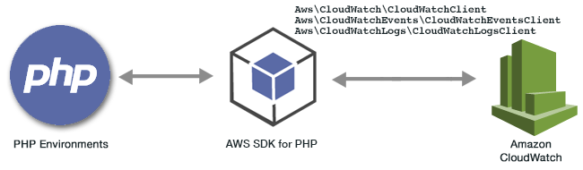

.. Copyright 2010-2018 Amazon.com, Inc. or its affiliates. All Rights Reserved.

   This work is licensed under a Creative Commons Attribution-NonCommercial-ShareAlike 4.0
   International License (the "License"). You may not use this file except in compliance with the
   License. A copy of the License is located at http://creativecommons.org/licenses/by-nc-sa/4.0/.

   This file is distributed on an "AS IS" BASIS, WITHOUT WARRANTIES OR CONDITIONS OF ANY KIND,
   either express or implied. See the License for the specific language governing permissions and
   limitations under the License.

###############################################
|CWlong| Examples Using the |sdk-php| Version 3
###############################################

.. meta::
   :description: Amazon CloudWatch code examples for the AWS SDK for PHP version 3
   :keywords: Amazon CloudWatch PHP examples , AWS SDK for PHP examples. Amazon CloudWatch

|CWlong| (|CW|) is a web service that monitors your |AWSlong| (AWS) resources and the applications you run on AWS in real time.
You can use |CW| to collect and track metrics, which are variables you can measure for your resources and applications.
|CW| alarms send notifications or automatically make changes to the resources you are monitoring based on rules that you define.

.. include:: text/git-php-examples.txt

.. toctree::
    :maxdepth: 1

    Working with Amazon CloudWatch Alarms <cw-examples-work-with-alarms.rst>
    Getting Metrics from Amazon CloudWatch <cw-examples-getting-metrics.rst>
    Publishing Custom Metrics in Amazon CloudWatch <cw-examples-publishing-custom-metrics.rst>
    Sending Events to Amazon CloudWatch Events <cw-examples-sending-events.rst>
    Using Alarm Actions with Amazon CloudWatch Alarms <cw-examples-using-alarm-actions.rst>

