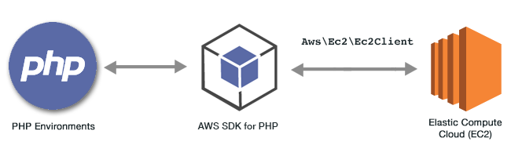

.. Copyright 2010-2018 Amazon.com, Inc. or its affiliates. All Rights Reserved.

   This work is licensed under a Creative Commons Attribution-NonCommercial-ShareAlike 4.0
   International License (the "License"). You may not use this file except in compliance with the
   License. A copy of the License is located at http://creativecommons.org/licenses/by-nc-sa/4.0/.

   This file is distributed on an "AS IS" BASIS, WITHOUT WARRANTIES OR CONDITIONS OF ANY KIND,
   either express or implied. See the License for the specific language governing permissions and
   limitations under the License.

############################################
|EC2| Examples Using the |sdk-php| Version 3
############################################

.. meta::
   :description: Programing  Elastic Compute Cloud using the AWS SDK for PHP version 3.
   :keywords: Elastic Compute Cloud (EC2), AWS SDK for PHP version 3 examples, EC2 for PHP code examples

|EC2long| (|EC2|) is a web service that provides virtual server hosting in the cloud. It's designed to make web-scale cloud computing easier for developers by providing resizeable compute capacity.

.. include:: text/git-php-examples.txt

.. toctree::
    :maxdepth: 1

    Managing Amazon EC2 Instances <ec2-examples-managing-instances.rst>
    Using Elastic IP Addresses <ec2-examples-using-elastic-ip-addresses.rst>
    Using Regions and Availability Zones <ec2-examples-using-regions-and-zones.rst>
    Working with Key Pairs <ec2-examples-working-with-key-pairs.rst>
    Working with Security Groups <ec2-examples-using-security-groups.rst>
