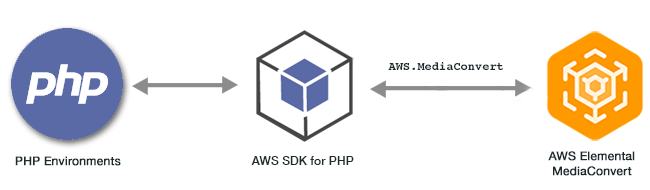

.. Copyright 2010-2018 Amazon.com, Inc. or its affiliates. All Rights Reserved.

   This work is licensed under a Creative Commons Attribution-NonCommercial-ShareAlike 4.0
   International License (the "License"). You may not use this file except in compliance with the
   License. A copy of the License is located at http://creativecommons.org/licenses/by-nc-sa/4.0/.

   This file is distributed on an "AS IS" BASIS, WITHOUT WARRANTIES OR CONDITIONS OF ANY KIND,
   either express or implied. See the License for the specific language governing permissions and
   limitations under the License.

################################################
|EMClong| Examples Using the |sdk-php| Version 3
################################################

.. meta::
   :description: Examples that show how to use the AWS Elemental MediaConvert client class using the AWS SDK for PHP version 3.
   :keywords: ECMAScript, AWS SDK for PHP version 3 examples, Elemental MediaConvert for PHP code examples

|EMClong| is a file-based video transcoding service with broadcast-grade features. You can use it to create assets for broadcast and for video-on-demand 
(VOD) delivery across the internet. For more information, see the |EMC-ug|_.

The PHP API for |EMClong| is exposed through the `AWS.MediaConvert` client class\. For more information, see :aws-php-class:`Class: AWS.MediaConvert </api-mediaconvert-2017-08-29.html>` 
in the API reference\.

.. include:: text/git-php-examples.txt

.. toctree::
    :maxdepth: 1

    Getting Your Account-Specific Endpoint <emc-examples-getendpoint.rst>
    Creating and Managing Jobs <emc-examples-jobs.rst>
    
