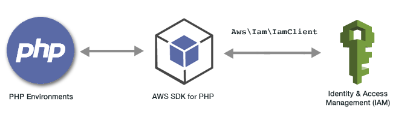

.. Copyright 2010-2018 Amazon.com, Inc. or its affiliates. All Rights Reserved.

   This work is licensed under a Creative Commons Attribution-NonCommercial-ShareAlike 4.0
   International License (the "License"). You may not use this file except in compliance with the
   License. A copy of the License is located at http://creativecommons.org/licenses/by-nc-sa/4.0/.

   This file is distributed on an "AS IS" BASIS, WITHOUT WARRANTIES OR CONDITIONS OF ANY KIND,
   either express or implied. See the License for the specific language governing permissions and
   limitations under the License.

################################################
AWS |IAM| Examples Using the |sdk-php| Version 3
################################################

.. meta::
   :description: Programing Itentity and Access Managment using the AWS SDK for PHP version 3.
   :keywords: AWS Identity and Access Management (IAM) code examples, AWS SDK for PHP version 3

|IAMlong|  (|IAM|) is a web service that enables |AWSlong| (AWS) customers to manage users and user permissions in AWS. The service is targeted at organizations with multiple users 
or systems in the cloud that use AWS products. With |IAM|, you can centrally manage users, security credentials such as access keys, and permissions that control which AWS resources users can access.

.. include:: text/git-php-examples.txt

.. toctree::
    :maxdepth: 1

    Managing IAM Access Keys <iam-examples-managing-access-keys.rst>
    Managing IAM Users <iam-examples-managing-users.rst>
    Using IAM Account Aliases <iam-examples-using-account-aliases.rst>
    Working with IAM Policies <iam-examples-working-with-policies.rst>
    Working with IAM Server Certificates <iam-examples-working-with-certs.rst>

    

