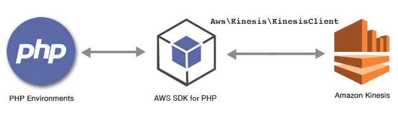

.. Copyright 2010-2019 Amazon.com, Inc. or its affiliates. All Rights Reserved.

   This work is licensed under a Creative Commons Attribution-NonCommercial-ShareAlike 4.0
   International License (the "License"). You may not use this file except in compliance with the
   License. A copy of the License is located at http://creativecommons.org/licenses/by-nc-sa/4.0/.

   This file is distributed on an "AS IS" BASIS, WITHOUT WARRANTIES OR CONDITIONS OF ANY KIND,
   either express or implied. See the License for the specific language governing permissions and
   limitations under the License.

################################################
|AKlong| Examples Using the |sdk-php| Version 3
################################################

.. meta::
   :description: Amazon Kinesis Data Streams and Amazon Kinesis Data Firehose code examples for the AWS SDK for PHP version 3.
   :keywords: Amazon Kinesis code examples for PHP, Amazon Kinesis Data Firehose for PHP, Delivery Streams for PHP, Amazon Kinesis Data Streams for PHP

|AKlong| is an AWS service that collects, processes, and analyzes data in real time.
Configure your data streams with |AKSlong| or use |AKFlong| to send data to |S3|, |ES|, |RS|, or Splunk.

For more information about |AK|, see the `Amazon Kinesis documentation <https://docs.aws.amazon.com/kinesis/index.html>`_.

All the example code for the |sdk-php| Version 3 is available `here on GitHub <https://github.com/awsdocs/aws-doc-sdk-examples/tree/master/php/example_code>`_.

.. toctree::
   :maxdepth: 1

   Kinesis Data Streams<kinesis-example-data-stream>
   Kinesis Shards <kinesis-example-shard>
   Kinesis Data Firehose Delivery Streams <kinesis-firehose-example-delivery-stream>
