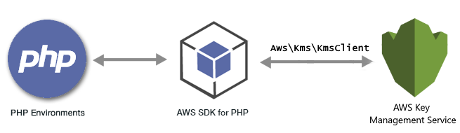

.. Copyright 2010-2018 Amazon.com, Inc. or its affiliates. All Rights Reserved.

   This work is licensed under a Creative Commons Attribution-NonCommercial-ShareAlike 4.0
   International License (the "License"). You may not use this file except in compliance with the
   License. A copy of the License is located at http://creativecommons.org/licenses/by-nc-sa/4.0/.

   This file is distributed on an "AS IS" BASIS, WITHOUT WARRANTIES OR CONDITIONS OF ANY KIND,
   either express or implied. See the License for the specific language governing permissions and
   limitations under the License.

################################################
|KMSlong| Examples Using the |sdk-php| Version 3
################################################

.. meta::
   :description: Amazon KMS code examples for the AWS SDK for PHP version 3.
   :keywords: Amazon KMS code examples for PHP, AWS Key Management Service

|KMSlong| (|KMS|) is a managed service that makes it easy for you to create and control the encryption keys used to encrypt your data. For
more information about |KMS|, see the `Amazon KMS documentation <http://aws.amazon.com/documentation/kms/>`_. Whether you are writing secure PHP applications or sending data to other AWS services, AWS KMS helps you maintain control over who can use your master keys and gain access to your encrypted data.

All the example code for the |sdk-php| Version 3 is available `here on GitHub <https://github.com/awsdocs/aws-doc-sdk-examples/tree/master/php/example_code>`_.

.. toctree::
   :maxdepth: 1

   Working with Keys<kms-example-keys>
   Encrypting and Decrypting Data Keys <kms-example-encrypt>
   Working with Key Policies <kms-example-key-policy>
   Working with Grants <kms-example-grants>
   Working with Aliases <kms-example-alias>
