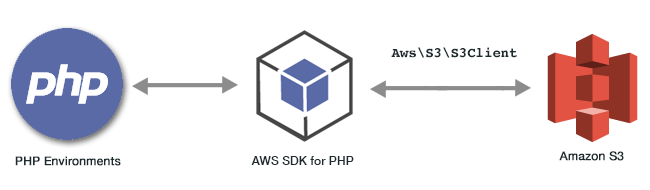

.. Copyright 2010-2019 Amazon.com, Inc. or its affiliates. All Rights Reserved.

   This work is licensed under a Creative Commons Attribution-NonCommercial-ShareAlike 4.0
   International License (the "License"). You may not use this file except in compliance with the
   License. A copy of the License is located at http://creativecommons.org/licenses/by-nc-sa/4.0/.

   This file is distributed on an "AS IS" BASIS, WITHOUT WARRANTIES OR CONDITIONS OF ANY KIND,
   either express or implied. See the License for the specific language governing permissions and
   limitations under the License.

###########################################
|S3| Examples Using the |sdk-php| Version 3
###########################################

.. meta::
   :description: Amazon S3 code examples for AWS SDK for PHP version 3.
   :keywords: Amazon S3 PHP examples , AWS SDK for PHP examples, Amazon Simple Storage Service for PHP code examples

|S3long|  (|S3|) is a web service that provides highly scalable cloud storage. |S3| provides easy to use object storage, with a simple web service interface to store and retrieve any amount of data from anywhere on the web.

.. include:: text/git-php-examples.txt

.. toctree::
    :maxdepth: 1

    Creating and Using Amazon S3 Buckets <s3-examples-creating-buckets.rst>
    Managing Amazon S3 Bucket Access Permissions <s3-examples-access-permissions.rst>
    Configuring Amazon S3 Buckets <s3-examples-configuring-a-bucket.rst>
    Using an Amazon S3 Bucket as a Static Web Host <s3-examples-static-web-host.rst>
    Working with Amazon S3 Bucket Policies <s3-examples-bucket-policies.rst>

