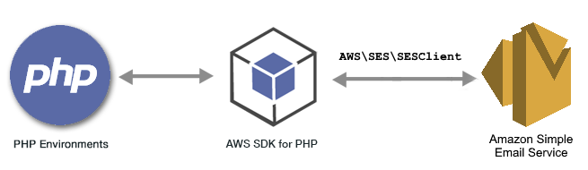

.. Copyright 2010-2018 Amazon.com, Inc. or its affiliates. All Rights Reserved.

   This work is licensed under a Creative Commons Attribution-NonCommercial-ShareAlike 4.0
   International License (the "License"). You may not use this file except in compliance with the
   License. A copy of the License is located at http://creativecommons.org/licenses/by-nc-sa/4.0/.

   This file is distributed on an "AS IS" BASIS, WITHOUT WARRANTIES OR CONDITIONS OF ANY KIND,
   either express or implied. See the License for the specific language governing permissions and
   limitations under the License.

############################################
|SES| Examples Using the |sdk-php| Version 3
############################################

.. meta::
   :description: Amazon SES code examples for the AWS SDK for PHP version 3.
   :keywords: Amazon Simple Email Service code examples for PHP, AWS Email, Amazon bulk email

|SESlong| (|SES|) is an email platform that provides an easy, cost-effective way for you to send and receive email using your own
email addresses and domains. For more information about |SES|, see the |SES-dg|_.

All the example code for the |sdk-php| version 3 is available `here on GitHub <https://github.com/awsdocs/aws-doc-sdk-examples/tree/master/php/example_code>`_.

.. toctree::
   :maxdepth: 1

   Verifying Email Addresses <ses-verify>
   Working with Email Templates <ses-template>
   Managing Email Filters <ses-filters>
   Using Email Rules <ses-rules>
   Monitor Your Sending Activity <ses-send-email>
   Authorizing Senders <ses-sender-policy>
