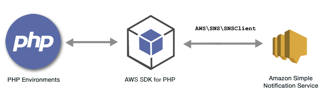

.. Copyright 2010-2018 Amazon.com, Inc. or its affiliates. All Rights Reserved.

   This work is licensed under a Creative Commons Attribution-NonCommercial-ShareAlike 4.0
   International License (the "License"). You may not use this file except in compliance with the
   License. A copy of the License is located at http://creativecommons.org/licenses/by-nc-sa/4.0/.

   This file is distributed on an "AS IS" BASIS, WITHOUT WARRANTIES OR CONDITIONS OF ANY KIND,
   either express or implied. See the License for the specific language governing permissions and
   limitations under the License.

#############################################
|SNS| Examples Using the |sdk-php| Version 3 
#############################################

.. meta::
   :description: Amazon SNS code examples for the AWS SDK for PHP version 3.
   :keywords: Amazon SNS code examples for PHP

|snslong|\ (|SNS|) is a web service that coordinates and manages the delivery or sending of messages to subscribing endpoints or clients.

In |snslong|, there are two types of clients—publishers and subscribers—also referred to as producers and consumers.

Publishers communicate asynchronously with subscribers by producing and sending a message to a topic. which is a logical access point and communication channel. 
Subscribers consume or receive the message through a supported protocol (|SQS|, HTTP/S, email, |SMS|, |LAM|) when a message is sent to the topic.
Web servers, email addresses, |SQS| queues, or Lambda functions can all be a subscriber.

Learn more about |SNSlong| in the |SNS-dg|_

All the example code for the |sdk-php| Version 3 is available `here on GitHub <https://github.com/awsdocs/aws-doc-sdk-examples/tree/master/php/example_code>`_.

.. toctree::
    :maxdepth: 1

    Managing Topics <sns-examples-managing-topics.rst>
    Publishing Messages to a Topic <sns-examples-publishing-messages.rst>
    Managing Subscriptions <sns-examples-subscribing-unsubscribing-topics.rst>
    Sending SMS Messages <sns-examples-sending-sms.rst>
    

