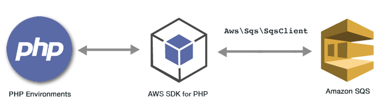

.. Copyright 2010-2018 Amazon.com, Inc. or its affiliates. All Rights Reserved.

   This work is licensed under a Creative Commons Attribution-NonCommercial-ShareAlike 4.0
   International License (the "License"). You may not use this file except in compliance with the
   License. A copy of the License is located at http://creativecommons.org/licenses/by-nc-sa/4.0/.

   This file is distributed on an "AS IS" BASIS, WITHOUT WARRANTIES OR CONDITIONS OF ANY KIND,
   either express or implied. See the License for the specific language governing permissions and
   limitations under the License.

#############################################
|SQS| Examples Using the |sdk-php| Version 3
#############################################

.. meta::
   :description: Amazon SQS code examples for the AWS SDK for PHP version 3.
   :keywords: Amazon SQS code examples for PHP

|SQSlong| (SQS) is a fast, reliable, scalable, fully managed message queuing service. |SQS| lets you decouple the components of a cloud application. |SQS|
includes standard queues with high throughput and at-least-once processing, and FIFO queues that provide FIFO (first>-in, first>-out) delivery and exactly-once processing.

All the example code for the |sdk-php| Version 3 is available `here on GitHub <https://github.com/awsdocs/aws-doc-sdk-examples/tree/master/php/example_code>`_.

.. toctree::
    :maxdepth: 1

    Enabling Long Polling <sqs-examples-enable-long-polling.rst>
    Managing Visibility Timeout <sqs-examples-managing-visibility-timeout.rst>
    Sending and Receiving Messages <sqs-examples-send-receive-messages.rst>
    Using Dead Letter Queues <sqs-examples-dead-letter-queues.rst>
    Using Queues <sqs-examples-using-queues.rst>
