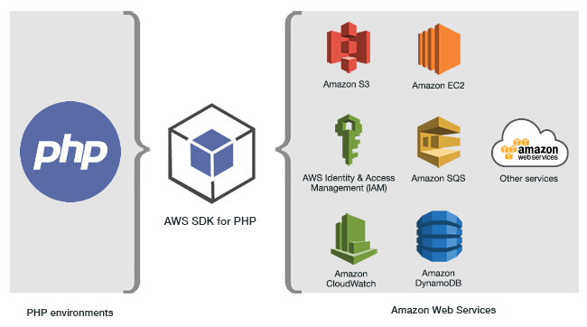

.. Copyright 2010-2018 Amazon.com, Inc. or its affiliates. All Rights Reserved.

   This work is licensed under a Creative Commons Attribution-NonCommercial-ShareAlike 4.0
   International License (the "License"). You may not use this file except in compliance with the
   License. A copy of the License is located at http://creativecommons.org/licenses/by-nc-sa/4.0/.

   This file is distributed on an "AS IS" BASIS, WITHOUT WARRANTIES OR CONDITIONS OF ANY KIND,
   either express or implied. See the License for the specific language governing permissions and
   limitations under the License.

#################################
What Is the |sdk-php| Version 3?
#################################

.. meta::
   :description: AWS SDK for PHP version 3 enables PHP developers to use Amazon Web Services in their PHP code.
   :keywords: AWS SDK for PHP version 3, AWS for PHP, Amazon PHP, 

The |sdk-php| Version 3 enables PHP developers to use  `Amazon Web Services <http://aws.amazon.com/>`_ 
in their PHP code, and build
robust applications and software using services like |S3|, |DDBlong|, |GL|, etc.
You can get started in minutes by installing the
SDK through Composer — by requiring the ``aws/aws-sdk-php`` package — or by
downloading the standalone `aws.zip <http://docs.aws.amazon.com/aws-sdk-php/v3/download/aws.zip>`_
or `aws.phar <http://docs.aws.amazon.com/aws-sdk-php/v3/download/aws.phar>`_ file.

Not all services are immediately available in the SDK. To find out which services are currently supported by the |sdk-php|, see :aws-php-class:`Service Name and API Version <index.html>`.
For information about the |sdk-php| Version 3 on GitHub, see :doc:`Additional Resources <resources>`.

External links: :aws-php-class:`API Docs <index.html>`
| `GitHub <https://github.com/aws/aws-sdk-php>`_
| `Gitter <https://gitter.im/aws/aws-sdk-php>`_
| :blog:`Blog <developer/category/php/>`
| `Forum <https://forums.aws.amazon.com/forum.jspa?forumID=80>`_
| `Packagist <https://packagist.org/packages/aws/aws-sdk-php>`_

.. note::

    If you're migrating your project's code from using Version 2 of the SDK to
    Version 3, be sure to read :doc:`getting-started_migration`.

Getting Started
===============

*  :doc:`getting-started_requirements`
*  :doc:`getting-started_installation`
*  :doc:`getting-started_basic-usage`
*  :doc:`getting-started_migration`

SDK Guides
==========

* :doc:`Configuration for the AWS SDK for PHP <guide_configuration>`
* :doc:`Credentials for the AWS SDK for PHP <guide_credentials>`
* :doc:`Command Objects in the AWS SDK for PHP <guide_commands>`
* :doc:`Promises in the AWS SDK for PHP <guide_promises>`
* :doc:`Handlers and Middleware in the AWS SDK for PHP <guide_handlers-and-middleware>`
* :doc:`Streams in the AWS SDK for PHP <guide_streams>`
* :doc:`Paginators in the AWS SDK for PHP <guide_paginators>`
* :doc:`Waiters in the AWS SDK for PHP <guide_waiters>`
* :doc:`JMESPath Expressions in the AWS SDK for PHP <guide_jmespath>`

Service-Specific Features
=========================

* :doc:`Signing Custom Amazon CloudSearch Domain Requests  <service_cloudsearch-custom-requests>`
* :doc:`Signing Amazon CloudFront URLs  <service_cloudfront-signed-url>`
* :doc:`Using AWS Cloud9 with the AWS SDK for PHP  <cloud9>`
* :doc:`Using the DynamoDB Session Handler with AWS SDK for PHP  <service_dynamodb-session-handler>`
* :doc:`Signing an Amazon Elasticsearch Service Search Request  <service_es-data-plane>`
* :doc:`Using Amazon S3 Multipart Uploads  <s3-multipart-upload>`
* :doc:`Amazon S3 Multi-Region Client  <s3-multiregion-client>`
* :doc:`Amazon S3 Pre-Signed POSTs  <s3-presigned-post>`
* :doc:`Amazon S3 Pre-Signed URL  <s3-presigned-url>`
* :doc:`Amazon S3 Stream Wrapper  <s3-stream-wrapper>`
* :doc:`Amazon S3 Transfer Manager  <s3-transfer>`
* :doc:`Amazon S3 Client Side Encryption  <s3-encryption-client>`

Examples
========
* :doc:`Amazon CloudWatch Examples <cw-examples>`
* :doc:`Amazon EC2 <ec2-examples>`
* :doc:`AWS IAM Examples <iam-examples>`
* :doc:`AWS Key Management Service <kms-examples>`
* :doc:`Amazon MediaConvert Examples <emc-examples>`
* :doc:`Amazon S3 Examples <s3-examples>`
* :doc:`Amazon Simple Email Services Examples <ses-examples>`
* :doc:`Amazon SQS Examples <sqs-examples>`

Reference
=========

* :doc:`FAQ <faq>`
* :doc:`Glossary <glossary>`
* `Contributing to the SDK <https://github.com/aws/aws-sdk-php/blob/master/CONTRIBUTING.md>`_
* `Guzzle Documentation <http://guzzlephp.org>`_

.. _supported-services:

API Documentation
=================

Find API documentation for the SDK at  http://docs.aws.amazon.com/aws-sdk-php/v3/api/.
